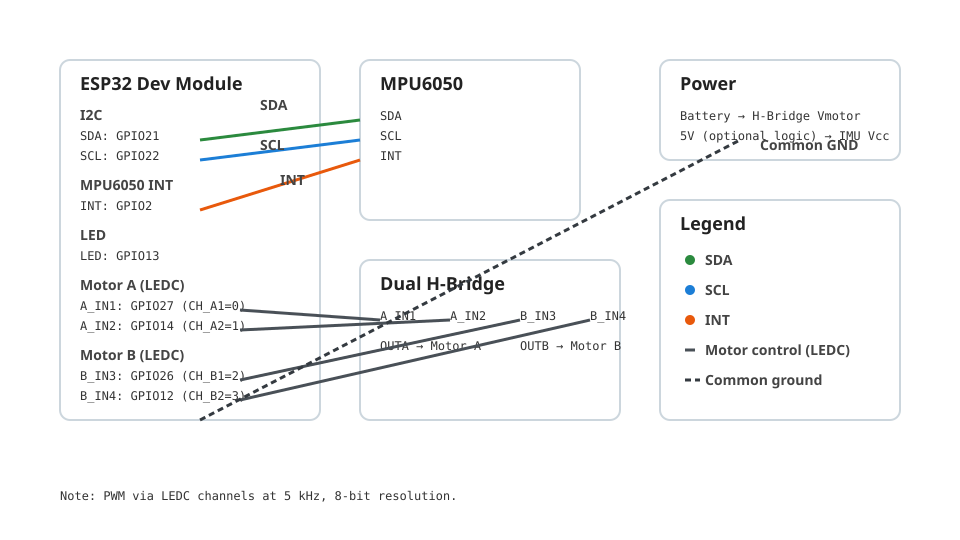
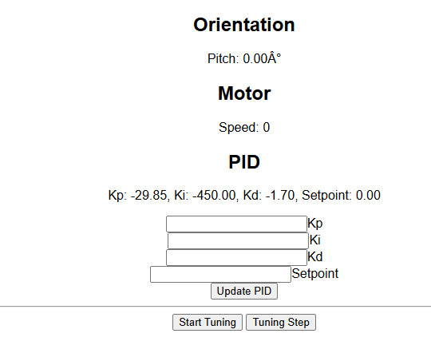

# ESP32 Self-Balancing Robot (Arduino)

An ESP32-powered self-balancing robot featuring:
- MPU6050 IMU (DMP) for stable orientation
- Real-time PID control driving dual motors via ESP32 LEDC PWM
- WiFi provisioning with captive portal (WiFiManager)
- Lightweight web UI + JSON API (ESPAsyncWebServer)
- EEPROM persistence for PID parameters and setpoint
- Optional auto-tuning workflow for Kp/Ki/Kd

This project prioritizes safety (motors off until IMU ready), non-blocking async networking, and iteration from a single Arduino sketch.

  
  
  
  

---

## Table of Contents
- Highlights
- Known Good Config
- Architecture Overview
- Hardware & Wiring
- Wiring Diagram
- Dependencies
- Build & Flash
- Runtime Behavior
- Web UI & API
- Safety Model
- PID & Tuning
- Manual PID Tuning Workflow
- Debugging Tips
- File Reference
- UI Preview
- License
- Support & Contributions
- Quick Links

---

## ✨ Highlights
- Motors explicitly OFF at boot and whenever IMU packets are unavailable
- Proper ESP32 LEDC channel configuration (5 kHz, 8-bit)
- Clean PID lifecycle: resets on parameter change and before tuning windows
- Tiny, built-in Web UI for live monitoring and editing PID values
- Robust EEPROM layout and commit semantics

---

## ✅ Known Good Config
Working PID values from the included screenshot (may depend on your motor polarity and wiring):
- `kp = -29.85`
- `ki = -450.00`
- `kd = -1.70`
- `setpoint = 0.00`

Apply via API:

`/setPID?kp=-29.85&ki=-450.00&kd=-1.70&setpoint=0`

Notes
- Negative gains indicate the chassis/motor polarity is reversed relative to the default. If your robot drives away from upright, flip motor wiring or change gain signs accordingly.
- After applying, values persist to EEPROM.

---

## 🧩 Architecture Overview
Single compilation unit: `PID_Auto_Tuner_Robot.ino`

- Startup
  - Begin serial and I2C (`Wire.begin(21, 22)`).
  - Load PID params + setpoint from EEPROM (floats at addresses 0, 4, 8, 12).
  - Provision WiFi via WiFiManager: opens AP `ESP32-Robot-Setup` (pwd `configure123`) if not configured; otherwise connects.
  - Set motor pins to OUTPUT + LOW, configure LEDC channels, and keep motors OFF.
  - Initialize MPU6050 with DMP, calibrate, start interrupt handler; set `dmpReady=true` on success.
  - Start Async Web Server with routes for status, PID updates, and tuning.

- Main Loop
  - Read the latest DMP FIFO packet; if none or not ready, keep motors OFF and return.
  - Compute pitch (deg) from DMP, gyro pitch rate from `gy/131`.
  - Guard the first PID iteration by setting the time baseline and keeping motors OFF.
  - Run PID: `output = kp*error + integral + kd*derivative` with integral clamped.
  - Apply signed output symmetrically to motor A and B via `applyMotor()` (channel-based LEDC writes).
  - Optional tuning mode: evaluate error over 2s windows, adjust deltas, persist improvements.

- Web Server (Async)
  - `/` tiny HTML/JS UI (served from PROGMEM)
  - `/status` returns `{ pitch, speed, kp, ki, kd, setpoint }`
  - `/setPID?kp=..&ki=..&kd=..&setpoint=..` updates parameters, resets PID state, saves to EEPROM
  - `/startTune` enables tuning mode; `/tuneStep` increments one parameter delta and resets the window

---

## 🛠️ Hardware & Wiring
- Board: ESP32 Dev Module
- IMU: MPU6050 (INT `GPIO2`, I2C SDA `GPIO21`, SCL `GPIO22`)
- Motors: Dual H-bridge (pins below drive PWM duty on channels)

Pins
- Motor A: `A_IN1=27`, `A_IN2=14`
- Motor B: `B_IN3=26`, `B_IN4=12`
- LED: `LED_PIN=13`
- MPU6050 Interrupt: `INTERRUPT_PIN=2`
- I2C: SDA `21`, SCL `22`

PWM (LEDC)
- Frequency: 5 kHz
- Resolution: 8-bit (0–255 duty)
- Channels: `CH_A1=0`, `CH_A2=1`, `CH_B1=2`, `CH_B2=3`

Important: Motor polarity matters. `applyMotor(m, spd, dir)` uses `dir > 0` to drive forward on channel 1 and zero channel 2; reverse does the opposite.

---

## 🖼️ Wiring Diagram
Visualizing the core connections.

- Included: `docs/wiring.svg`
- Covers ESP32 pins, MPU6050 (SDA/SCL/INT), motor driver IN/OUT, power rails, and ground.

---

## 📦 Dependencies
Install via Arduino Library Manager or GitHub:
- WiFiManager (tzapu/WiFiManager)
- ESPAsyncWebServer (me-no-dev) + AsyncTCP
- I2Cdevlib MPU6050 with MotionApps20 (`MPU6050_6Axis_MotionApps20.h`)
- EEPROM (bundled with ESP32 core)

Board package: Arduino ESP32 (Espressif)

---

## 🚀 Build & Flash
1. Open `PID_Auto_Tuner_Robot.ino` in Arduino IDE or VS Code + Arduino extension.
2. Select board: “ESP32 Dev Module”; set upload speed as preferred.
3. Ensure required libraries are installed.
4. Connect the ESP32 via USB.
5. Upload the sketch.

Serial Monitor
- Baud `115200`.
- Expect WiFi setup logs, IP address, and MPU/DMP status.

---

## 🧭 Runtime Behavior
- Motors OFF until both conditions are met:
  - `dmpReady == true`
  - A valid DMP FIFO packet is read in `loop()`
- First PID cycle guard prevents a large derivative spike.
- Continuous telemetry prints: `Pitch`, `Setpoint`, `Output`, `Gyro`.
- LED toggles every control loop iteration.

Motor Control
- Output is clamped to `[-255, 255]`.
- Speed = `abs(output)`, Direction = `output >= 0 ? 1 : -1`.
- Symmetric drive for A and B; adjust only if your chassis requires differential behavior.

---

## 🌐 Web UI & API
Once connected to WiFi:
- Open the device IP in a browser to view the mini dashboard.
- Updates every second via `fetch('/status')`.

Routes
- `/` — HTML status page (pitch, current speed, PID values)
- `/status` — JSON: `{ pitch, speed, kp, ki, kd, setpoint }`
- `/setPID` — query parameters: `kp`, `ki`, `kd`, `setpoint`
  - Example: `/setPID?kp=22.0&ki=0.6&kd=0.15&setpoint=0`
  - Resets PID state and persists to EEPROM
- `/startTune` — starts tuning mode (resets window)
- `/tuneStep` — bumps current parameter by its delta, resets evaluation window

UI Interactions
- Numeric inputs for Kp/Ki/Kd/Setpoint
- Buttons: Update PID, Start Tuning, Tuning Step

---

## 🔐 Safety Model
- Motors forced OFF at boot:
  - Pins set `OUTPUT + LOW`
  - LEDC channels configured and zero duty written
- Motors OFF whenever IMU is not ready or a packet isn’t read.
- PID reset after parameter changes or tuning steps.

Suggested additions (optional):
- Arm/Stop endpoints (`/arm`, `/stop`) with a global `enableDrive` flag
- IMU timeout: if no DMP packet for >200 ms, cut motors
- Output deadband & minPWM to overcome static friction

---

## 🎛️ PID & Tuning
PID Terms
- `kp` — proportional
- `ki` — integral (scaled by `delta/1000.0` seconds; clamped to ±255)
- `kd` — derivative over `delta/1000.0` seconds

Workflow
1. Start with conservative defaults (`kp=20`, `ki=0.5`, `kd=0.1`, `setpoint=0`).
2. Use Web UI to live-update parameters; observe status.
3. For auto-tuning: `/startTune` then repeat `/tuneStep`.
   - 2s evaluation windows accumulate error: `|pitch - setpoint| + 0.05*|gyroPitchRate|`.
   - Better error → grow delta and persist; worse → shrink delta and flip.

EEPROM Persistence
- Layout (float): `ADDR_KP=0`, `ADDR_KI=4`, `ADDR_KD=8`, `ADDR_SETPOINT=12`.
- After any write, `EEPROM.commit()` is called.
- On boot, NaN guard sets sensible defaults.

---

## 🧠 Manual PID Tuning Workflow
This guide helps you manually tune Kp, Ki, and Kd using the built-in Web UI and `/setPID` endpoint. Start conservatively and prioritize safety.

Preparation
- Ensure the robot is on a flat surface and can lean without hitting obstacles.
- Confirm motors only engage when IMU DMP packets are available (see Runtime Behavior).
- Start with defaults: `kp=20`, `ki=0.5`, `kd=0.1`, `setpoint=0`.

Controls to Use
- Web UI inputs for `Kp`, `Ki`, `Kd`, `Setpoint`; click “Update PID”.
- Or API: `/setPID?kp=...&ki=...&kd=...&setpoint=...`.
- The system automatically resets PID state on parameter change, avoiding spikes.

Step-by-Step
1. Tune Kp first.
  - Increase `kp` gradually until the robot responds quickly and begins slight oscillation around upright.
  - If motion is sluggish, raise `kp`. If oscillation becomes large or unstable, lower `kp`.
2. Add Kd to damp oscillations.
  - Increase `kd` to reduce overshoot and oscillation. Too much `kd` makes the system “stiff” or noisy.
3. Introduce small Ki to correct steady-state bias.
  - Increase `ki` slowly to eliminate persistent lean (bias). Too much causes slow-growing oscillations or drift.
4. Iterate.
  - Revisit `kp` after setting `kd` and `ki`; small adjustments will be needed.

Symptoms and Adjustments
- Slow to stand up → Increase `kp`.
- Oscillates/overshoots → Increase `kd` or reduce `kp`.
- Holds a lean (bias) → Increase `ki` slightly.
- “Twitchy” with noise → Reduce `kd` or add minimal `ki` and lower `kp`.
- Integral windup evident (late surges) → Reduce `ki`; consider widening deadband or clamping integral (already clamped).

Example Sequence
- Start: `kp=20`, `ki=0.5`, `kd=0.1`.
- Raise `kp` in steps of 2–3 until minor oscillation appears (e.g., `kp≈26`).
- Increase `kd` in steps of 0.05–0.1 to settle oscillation (e.g., `kd≈0.20`).
- Nudge `ki` by 0.05–0.1 to remove residual bias (e.g., `ki≈0.6`).
- Fine-tune: ±1 on `kp`, ±0.05 on `kd`, ±0.05 on `ki`.

Using Setpoint
- Leave `setpoint=0` for upright balancing.
- If your mechanical center differs, adjust `setpoint` slightly (±1–2°) to match the true vertical seen by pitch readings.

Saving and Verifying
- Values persist to EEPROM automatically via `/setPID`.
- Verify in `/status`: `{ pitch, speed, kp, ki, kd, setpoint }`.

Safety Tips
- Make small changes; wait a few seconds to observe behavior.
- If the robot accelerates unexpectedly, lower `kp` and/or `ki`, and ensure IMU DMP is stable.
- Consider adding an arm/stop endpoint (see Safety Model suggestions) for quick disable.

API Quick Examples
- Increase proportional gain:
  - `/setPID?kp=24&ki=0.5&kd=0.15&setpoint=0`
- Add more damping:
  - `/setPID?kp=24&ki=0.5&kd=0.25&setpoint=0`
- Trim out bias:
  - `/setPID?kp=24&ki=0.6&kd=0.25&setpoint=0`

Notes
- Tuning is sensitive to battery voltage, motor friction, and sensor noise; re-verify after hardware changes.
- The control loop clamps output to `[-255, 255]`; extreme gains saturate motors and reduce control authority.

---

## 🧪 Debugging Tips
- If motors move at boot, verify:
  - Pins are OUTPUT+LOW before LEDC attach.
  - LEDC writes use channels, not pin numbers.
  - IMU `dmpReady` and FIFO packet gating remain intact.
- If IMU doesn’t initialize:
  - Check wiring: SDA=21, SCL=22, INT=2; common GND.
  - Ensure `MPU6050_6Axis_MotionApps20.h` is present.
- For WiFi issues:
  - Reboot and use captive portal `ESP32-Robot-Setup` / `configure123`.

---

## 🧩 File Reference
- `PID_Auto_Tuner_Robot.ino` — Entire application: init, control loop, UI/API, EEPROM, tuning

Key Functions
- `applyMotor(m, spd, dir)` — Writes PWM to LEDC channels for motor A/B
- `dmpDataReady()` — Interrupt handler to flag new IMU data
- Web handlers — `server.on("/status")`, `server.on("/setPID")`, `server.on("/startTune")`, `server.on("/tuneStep")`

---

## 📸 UI Preview (Text)
- Orientation card: Pitch in degrees
- Motor card: Current speed (0–255)
- PID card: Kp, Ki, Kd, Setpoint with editable inputs
- Actions: Update PID, Start Tuning, Tuning Step

Screenshot

Working PID Values (from screenshot)
- `kp = -29.85`
- `ki = -450.00`
- `kd = -1.70`
- `setpoint = 0.00`

---

## 📜 License
Project code is provided as-is. Add your preferred license file if required.

---

## 🙋 Support & Contributions
- Open issues for wiring questions, library mismatches, or feature requests
- PRs welcome for: arm/stop endpoints, IMU timeout failsafe, deadband/minPWM, UI enhancements

---

## Quick Links
- WiFiManager: https://github.com/tzapu/WiFiManager
- ESPAsyncWebServer: https://github.com/me-no-dev/ESPAsyncWebServer
- I2Cdevlib MPU6050: https://github.com/jrowberg/i2cdevlib
- Arduino ESP32: https://github.com/espressif/arduino-esp32
